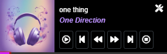

# cr_player

`cr_player` is a simple music player for websites, making it easy to integrate and use music playback features on your webpage.


### Installation

1. Download `cr_player.js` from your GitHub repository.
2. Add the `cr_player.js` file to your web project.

```html
    <!-- Load cr_player.js -->
    <script src="path/to/cr_player.js"></script>
    <script>
        // Initialize cr_player
        cr_player.onCreate();

        // Example: Play an audio file
        cr_player.play('url/to/your/audiofile.mp3');
    </script>
````

## The main and important method




>`cr_player`  has two basic methods to play a song. Additionally, if you want other customizations and upgrades that this player can provide, please take the time to read through this guide to better understand it.

#### `cr_player.onCreate()`

This function is called to initialize the music player when the webpage loads. You should call this function right after loading `cr_player.js` in your HTML file.

```javascript
cr_player.onCreate();
```

#### `cr_player.play(url_audio)`

This function is used to play an audio file. You need to pass in the URL of the audio file you want to play.

```javascript
cr_player.play('url/to/your/audiofile.mp3');
```

### Complete Example

Here is a complete example of how to use `cr_player` on your website:

```html
<!DOCTYPE html>
<html lang="en">
<head>
    <meta charset="UTF-8">
    <meta name="viewport" content="width=device-width, initial-scale=1.0">
    <title>Music Player</title>
</head>
<body>
    <h1>Welcome to My Music Player</h1>
    <button onclick="cr_player.play('url/to/your/audiofile.mp3')">Play Music</button>
    <!-- Load cr_player.js -->
    <script src="path/to/cr_player.js"></script>
    <script>
        // Initialize cr_player
        cr_player.onCreate();

        // Example: Play an audio file when the user clicks the button
        document.querySelector('button').addEventListener('click', function() {
            cr_player.play('url/to/your/audiofile.mp3');
        });
    </script>
</body>
</html>
```

### Adding Songs to Playlist

You can add songs to the currently playing playlist using one of the following methods:

#### 1. `add_song(url_mp3)`

This method adds a song to the playlist with just the URL to the MP3 file.

```javascript
// Syntax
cr_player.add_song(url_mp3);

// Example
cr_player.add_song('https://example.com/music/song1.mp3');
```

#### 2. `add_song(url_mp3, name, artist)`

This method adds a song to the playlist with the URL to the MP3 file, the song name, and the artist name.

```javascript
// Syntax
cr_player.add_song(url_mp3, name, artist);

// Example
cr_player.add_song('https://example.com/music/song2.mp3', 'Song Title', 'Artist Name');
```
## Control Methods

Below are the methods available for controlling the playback and settings of `cr_player`.

### playOrPause()

Toggles between playing and pausing the current audio.

```javascript
cr_player.playOrPause();
```

### next_song()

Plays the next song in the playlist.

```javascript
cr_player.next_song();
```

### prev_song()

Plays the previous song in the playlist.

```javascript
cr_player.prev_song();
```

### seekbackward()

Seeks backward by a set amount of time.

```javascript
cr_player.seekbackward();
```

### seekforward()

Seeks forward by a set amount of time.

```javascript
cr_player.seekforward();
```

### set_time_step(timer)

Sets the time step for seeking forward or backward.

*Parameters:*

- `timer` (Number): The amount of time (in seconds) to seek forward or backward.

```javascript
cr_player.set_time_step(10);
```

### stop()

Stops the current audio and resets the playback position to the beginning.

```javascript
cr_player.stop();
```

### show_playlist()

Displays the playlist.

```javascript
cr_player.show_playlist();
```
### show_setting()

Displays the settings menu.

```javascript
cr_player.show_setting();
```

## cr_player Media Session Guide

This guide provides instructions on how to enable and disable the `mediaSession` feature in `cr_player`. The `mediaSession` can be toggled programmatically via commands or manually through the settings interface.

### Enabling/Disabling Media Session Programmatically

You can enable or disable the `mediaSession` feature using the following commands:


```javascript
//Enable Media Session
cr_player.mediaSession = true;

//Disable Media Session
cr_player.mediaSession = false;

```

## set_theme(name_theme)

The set_theme method allows you to set the theme for the *cr_player*. The `name_theme` parameter can take one of the following values:

- `theme_basic_top`: Sets the theme to have the player controls at the top.
- `theme_basic_bottom`: Sets the theme to have the player controls at the bottom.
- `theme_dock_left`: Sets the theme to dock the player on the left side.
- `theme_dock_right`: Sets the theme to dock the player on the right side.

```javascript
// Set the player theme to have controls at the top
cr_player.set_theme('theme_basic_top');

// Set the player theme to have controls at the bottom
cr_player.set_theme('theme_basic_bottom');

// Set the player theme to dock on the left side
cr_player.set_theme('theme_dock_left');

// Set the player theme to dock on the right side
cr_player.set_theme('theme_dock_right');

```

## Contact

I hope this guide helps you easily install and use `cr_player` for your web project. If you have any questions or encounter any issues, please create an issue on GitHub or contact me via email.

- Email: [tranthienthanh93@gmail.com](mailto:tranthienthanh93@gmail.com)
- Email: [tranrot93@gmail.com](mailto:tranrot93@gmail.com)

## Donation 

[](https://ko-fi.com/T6T210E258)

 `Donation`: Please support me with a portion of the costs to maintain the server and services for everyone 

[](https://www.paypal.com/paypalme/kurotsmile)

## Thanks

Thank you for using `cr_player`!
